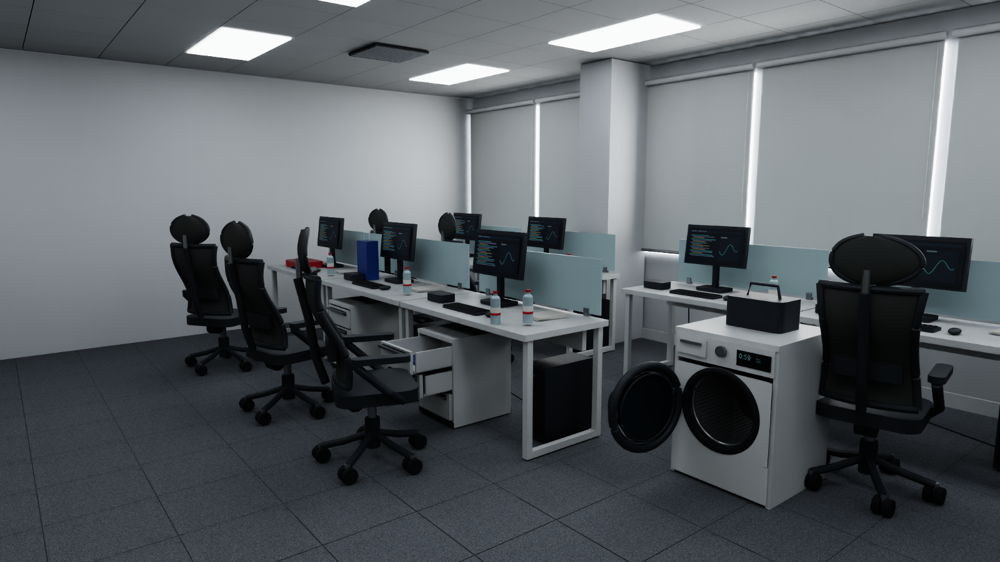
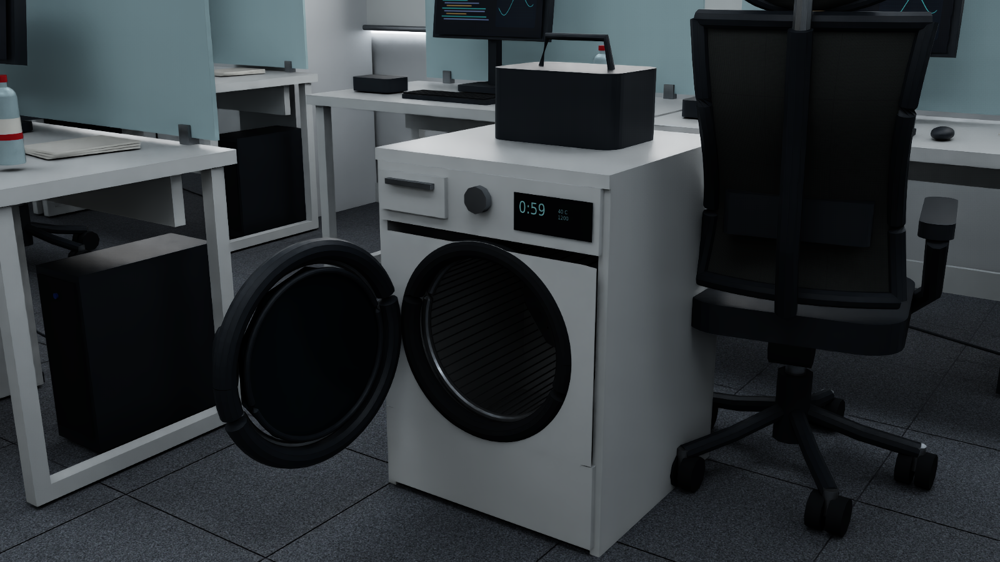
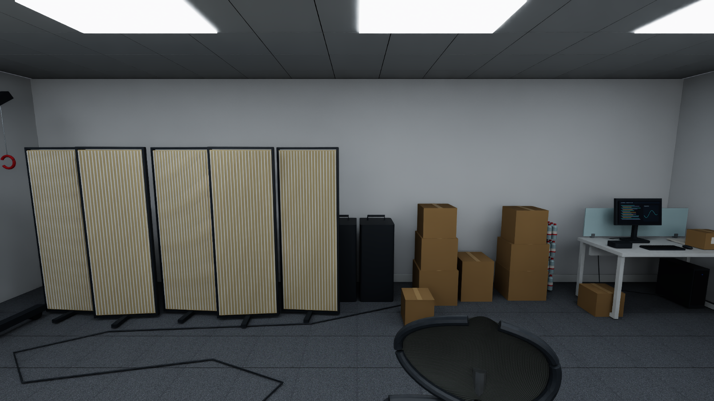

# Isaac Sim Office Real2Sim

基于三张办公室照片构建的 **Isaac Sim 可交互三维场景**：包含白色工位、网面办公椅、滚筒洗衣机、抽屉柜、木色屏风、吊机和储物区。几何、材质、碰撞和关节保存在 OpenUSD 中，可直接加载、编辑或通过 Python 控制。

**这是根据照片进行的程序化近似重建。** 房间尺寸、遮挡区域和物理参数采用估计值；本项目没有实现自动摄影测量、3D Gaussian Splatting，也没有调用截图中提到的 Astra 重建服务。目标是提供可复现、可交互的仿真原型。



[查看 5 秒交互视频（MP4，1600 × 900 / 24 fps）](renders/office_interaction.mp4) · [查看物理验证报告](validation_report.json)

## 能交互什么？

| 对象 | 关节 / 物理行为 | 控制范围 |
| --- | --- | --- |
| 洗衣机圆门 | Z 轴铰链，力驱动 | -112°～0° |
| 前排主椅座椅 | Z 轴旋转 | -175°～175° |
| 抽屉柜 A，三个抽屉 | Y 轴滑动 | -0.34～0 m |
| 抽屉柜 B，三个抽屉 | Y 轴滑动 | -0.34～0 m |
| 吊机臂 | X 轴旋转 | -12°～18° |
| 独立桌面水瓶、一个纸箱 | 自由刚体 | 重力、接触与碰撞 |

共 **9 个可驱动关节、11 个动态刚体**。其他重复椅子与桌面小件主要作为静态环境。门和抽屉使用真实 USD Physics 约束及 Drive 力驱动，控制器改变关节目标值。

> 洗衣机门控制：`0` 为关闭，`-90` 为打开 90°。直接移动外壳或几何部件不等于控制铰链。



## 快速开始

### 1. 准备环境

测试环境：**Ubuntu / Isaac Sim 6.0.0.1 / NVIDIA RTX 4090**。需要已经可运行的 Isaac Sim Python 环境及其图形驱动；普通 Python 环境仅安装 NumPy 并不足以启动仿真。其他 Isaac Sim 版本尚未验证。

```bash
git clone https://github.com/vigorlee/isaacsim-office-real2sim.git
cd isaacsim-office-real2sim
```

如果仓库为私有，请先使用有权限的 GitHub 账号认证。

### 2. 启动交互窗口

在已经激活 Isaac Sim 的 Python 环境中：

```bash
./launch_office.sh
```

也可以指定 Isaac Sim 环境的 Python 可执行文件，或官方安装目录中的 `python.sh`：

```bash
ISAACSIM_PYTHON=/path/to/isaacsim/env/bin/python ./launch_office.sh
# 或
ISAACSIM_PYTHON=/path/to/isaac-sim/python.sh ./launch_office.sh
```

启动器默认传递 `OMNI_KIT_ACCEPT_EULA=YES`；使用前应已接受本机 Isaac Sim 的适用许可。

打开右侧 **Office | Interactive objects** 控制面板：

1. 点击 **Play** 开始仿真。
2. 拖动 **Washer door (degrees)** 打开或关闭洗衣机门。
3. 使用 Chair / Drawer / Crane 滑块控制其余关节；向下滚动可看到全部九个控件。
4. 点击相机按钮切换工位、椅子、洗衣机、储物区与全景。
5. **Pause** 暂停；**Reset** 恢复初始状态。

为了给场景和控制面板腾出空间，启动脚本会隐藏当前应用窗口的默认 Stage、Property、Content 等面板；可从 Isaac Sim 的 Window 菜单重新打开。

### 3. 直接加载 USD

在 Isaac Sim 中选择 **File → Open → `office_interactive.usda`**，也可加载二进制副本 `office_interactive.usdc`。两者包含相同初始几何和物理设置。

**直接打开 USD 会保留物理关节，但不会自动显示本项目的 Python 控制面板。** 如需滑块交互，请使用启动脚本。

贴图使用相对路径 `textures/`，复制或移动时保留整个项目目录。场景单位为米，Z 轴向上。

## Python 控制铰链和抽屉

在已经打开本场景的 Isaac Sim Python / Script Editor 中运行。先将下面路径替换成自己的仓库路径：

```python
import sys
import omni.usd
import omni.timeline

sys.path.insert(0, "/path/to/isaacsim-office-real2sim")
from office_controls import set_target, close_all

stage = omni.usd.get_context().get_stage()
omni.timeline.get_timeline_interface().play()

set_target(stage, "washer", -90)       # 门打开 90 度
set_target(stage, "drawer_a1", -0.30) # A 柜第一个抽屉拉出 30 cm
set_target(stage, "chair", 55)        # 主椅旋转 55 度
set_target(stage, "crane", 10)        # 吊机臂旋转 10 度

# close_all(stage)                    # 所有关节目标归零
```

可用名称：`washer`、`chair`、`crane`、`drawer_a1`～`drawer_a3`、`drawer_b1`～`drawer_b3`。角度单位为度，抽屉位移单位为米，超出范围会抛出 `ValueError`。控制需要仿真处于 Play 状态；`set_target` 设置的是目标值，不是立即移动几何。

关节与物体路径、上下限见 [scene_manifest.json](scene_manifest.json)。例如门铰链为 `/World/Joints/WasherDoor`，门刚体为 `/World/Washer/Door`。

## 实际验证结果

仓库附带的是本机 Isaac Sim 中实际执行后的结果，包含目标值、测量值和前后位姿：

| 验证项 | 结果 |
| --- | --- |
| 9 个关节的目标运动 | 9 / 9 通过 |
| 水瓶在重力作用下由桌面支撑 | 通过 |
| 动态刚体位姿均为有限值 | 通过 |
| USD 组合错误 | 0 |
| 缺失资源路径 | 0 |

旋转目标误差阈值为 4°，抽屉位移误差阈值为 0.025 m。这些是运行检查，不代表全工作空间、负载范围或真机标定已经完成。原始场景的详细测量见 [validation_report.json](validation_report.json)。

在自己的机器重新验证：

```bash
./launch_office.sh --headless --validate
```

生成多视角渲染图：

```bash
./launch_office.sh --headless --capture --validate
```

生成演示帧并编码视频（编码需要本机 `ffmpeg`）：

```bash
./launch_office.sh --headless --video
ffmpeg -y -framerate 24 -i renders/frames/%04d.png \
  -c:v libx264 -crf 19 -pix_fmt yuv420p -movflags +faststart \
  renders/office_interaction.mp4
```

`--headless` 仍需要可工作的 RTX / GPU 渲染环境。重新渲染会覆盖同名效果图；验证会更新报告。逐帧图片已被 `.gitignore` 排除。

## 重新生成场景

已提供可直接打开的 USD；通常无需重新生成。修改布局或几何时，在具有 `pxr`、NumPy、Pillow 的 Python 环境中执行：

```bash
python build_scene.py
```

生成器会覆盖两个 USD、程序化贴图和场景清单。Linux 默认字体路径为 `/usr/share/fonts/truetype/dejavu/DejaVuSans.ttf`；其他系统需调整 `build_scene.py` 中的 `font_path`。生成器使用固定随机种子；原始照片不是运行依赖，也未随仓库分发。

## 文件说明

```text
.
├── README.md                  # 使用说明与项目范围
├── build_scene.py             # 程序化几何、材质、布局与物理生成
├── run_office.py               # Isaac Sim 启动、UI、渲染、运行验证
├── office_controls.py          # 关节控制接口
├── launch_office.sh            # 可指定 Python 路径的启动器
├── office_interactive.usda     # 可读 OpenUSD 场景
├── office_interactive.usdc     # 二进制场景副本
├── scene_manifest.json        # 物体路径、关节范围、统计
├── validation_report.json     # 实际仿真验证报告
├── textures/                  # 本地生成的材质贴图
└── renders/                   # 实际渲染效果与 MP4 演示
```



## 当前范围与后续工作

- 房间暂设为 **9 × 8 × 2.9 m**，布局、尺寸、质量和接触参数均为近似值，不能直接作为真机精度基准。
- 主椅的底座固定，当前实现座椅旋转；轮子没有独立滚动关节。
- 吊钩跟随吊臂，未实现柔性钢丝绳与独立升降。
- 洗衣机只建模外形、内筒和门铰链，没有模拟衣物、水流或电器工作过程；场景中未加入冰箱。
- 碰撞采用基础几何与凸包。机械臂精细抓取、导航或 sim-to-real 实验应进一步标定几何、惯性与摩擦，并补充任务层测试。
- 仓库没有包含机器人、策略模型或 ROS 接口；可在此环境上继续接入。

接口参考：[NVIDIA Isaac Sim Standalone Python](https://docs.isaacsim.omniverse.nvidia.com/latest/python_scripting/manual_standalone_python.html)。
